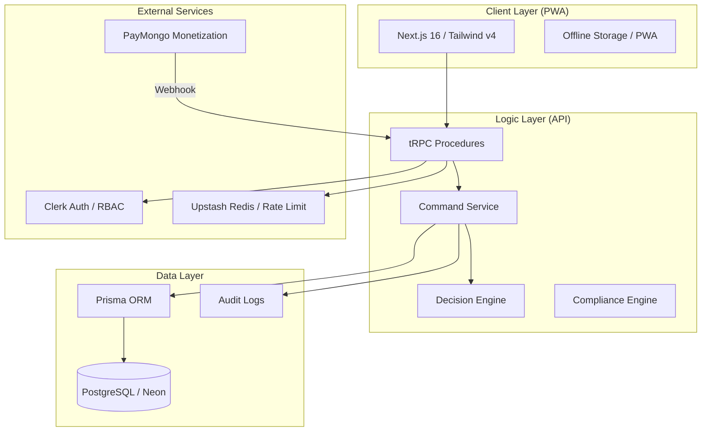
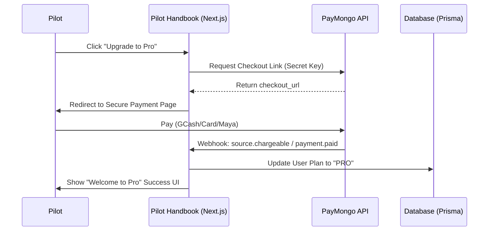
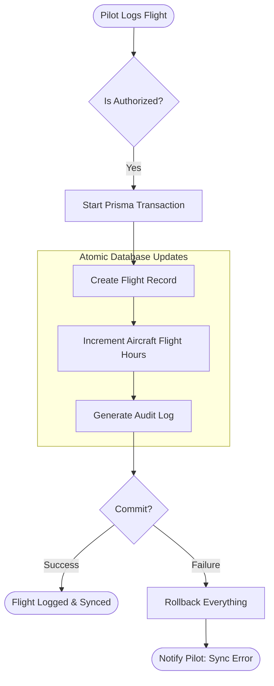
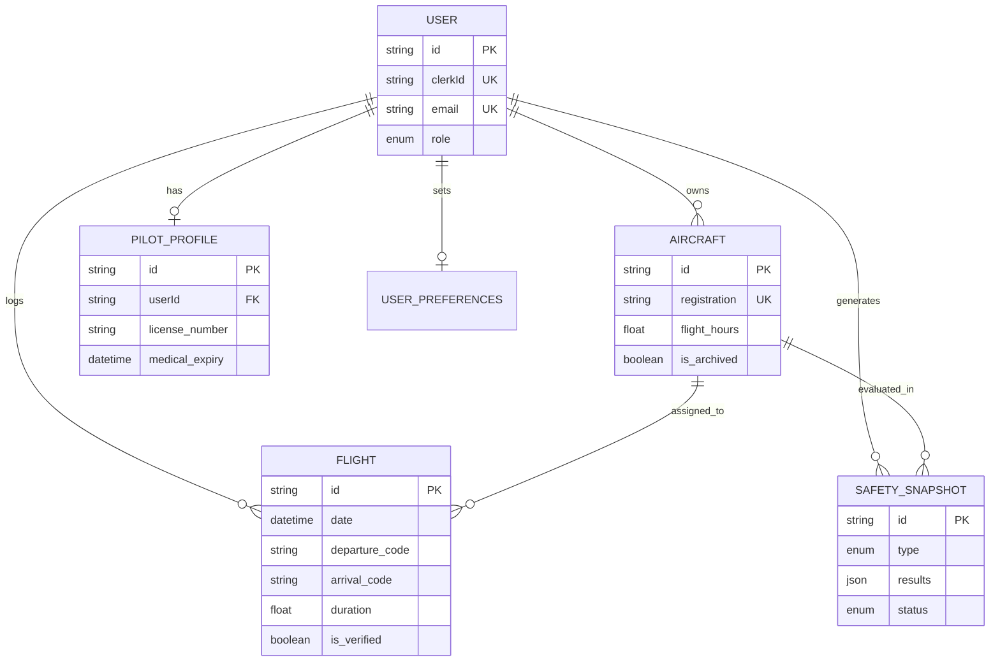
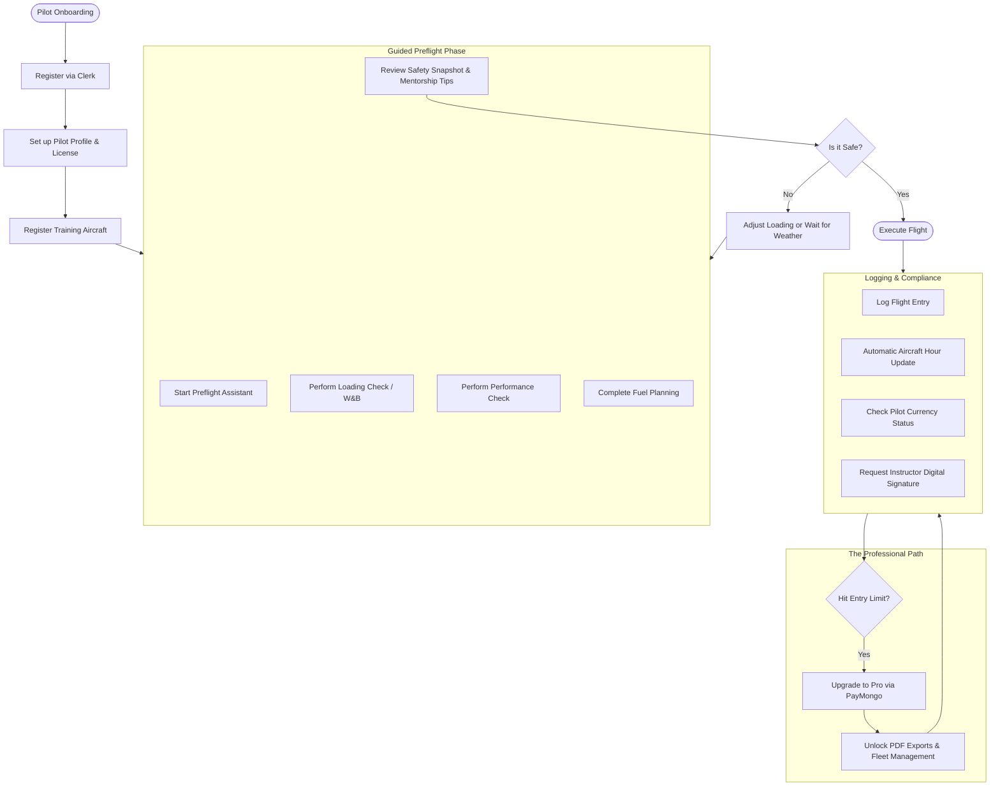

# PilotHandbook System Architecture

# Monetization & Verification Flow

> [!NOTE]
> **Conceptual Architecture:** The following payment flows and PayMongo integrations represent planned premium features. They are not currently active in the database schema or code repository.

# Data Integrity: The Transaction Plan

# PilotHandbook Database Schema (ER Diagram)

`SafetySnapshot.type` is constrained to `DENSITY_ALTITUDE`, `WEIGHT_BALANCE`, or `FUEL`.
`SafetySnapshot.status` is constrained to `NORMAL`, `CAUTION`, `WARNING`, or `INVALID`.

# 🚀 User Journey: From Onboarding to Professional Operations

